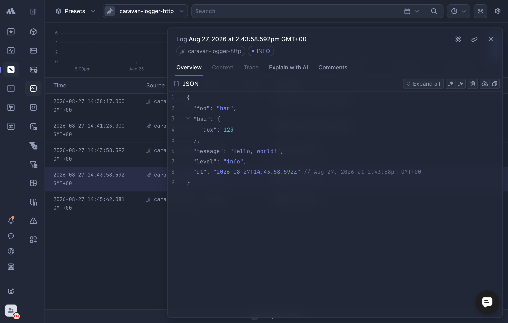

# @caravan-logger/transport-better-stack

  

A [Caravan](../../README.md) transport that sends log records to
[Better Stack's Logs ingesting API](https://betterstack.com/docs/logs/http-rest-api/).

## Install

```sh
pnpm add @caravan-logger/transport-better-stack
```

## Usage

```ts
import { createLogger } from "@caravan-logger/logger";
import { createBetterStackTransport } from "@caravan-logger/transport-better-stack";

const logger = createLogger("app", {
  transports: [
    createBetterStackTransport({
      sourceToken: process.env.BETTER_STACK_SOURCE_TOKEN!,
      endpoint: process.env.BETTER_STACK_INGESTING_HOST!,
    }),
  ],
});

logger.info("server started", { port: 3000 });
await logger.flush();
```



## Options

| Option               | Type                                              | Default                      | Description                                                                                                                                                      |
| -------------------- | ------------------------------------------------- | ---------------------------- | ---------------------------------------------------------------------------------------------------------------------------------------------------------------- |
| `sourceToken`        | `string`                                          | —                            | Better Stack source token (required).                                                                                                                            |
| `endpoint`           | `string`                                          | —                            | Ingesting host for the source (required). Each source has its own host, found on the source's page.                                                              |
| `format`             | `(record: TLogRecord) => Record<string, unknown>` | default Better Stack mapping | Overrides how a record is mapped to a Better Stack log entry.                                                                                                    |
| `batch`              | `boolean`                                         | `false`                      | Enables buffering records into batched sends.                                                                                                                    |
| `batchConfiguration` | `{ size?: number; flushInterval?: number }`       | —                            | Tunes batching: `size` records buffered before a send (default `1`), and/or `flushInterval` (ms) to send regardless of `size`. Only used when `batch` is `true`. |
| `fetch`              | `typeof fetch`                                    | global `fetch`               | Fetch implementation used to call the ingesting API.                                                                                                             |
| `level`              | `TDefaultLevels`                                  | inherits the logger's level  | Drops records below this level before `write()` runs.                                                                                                            |
