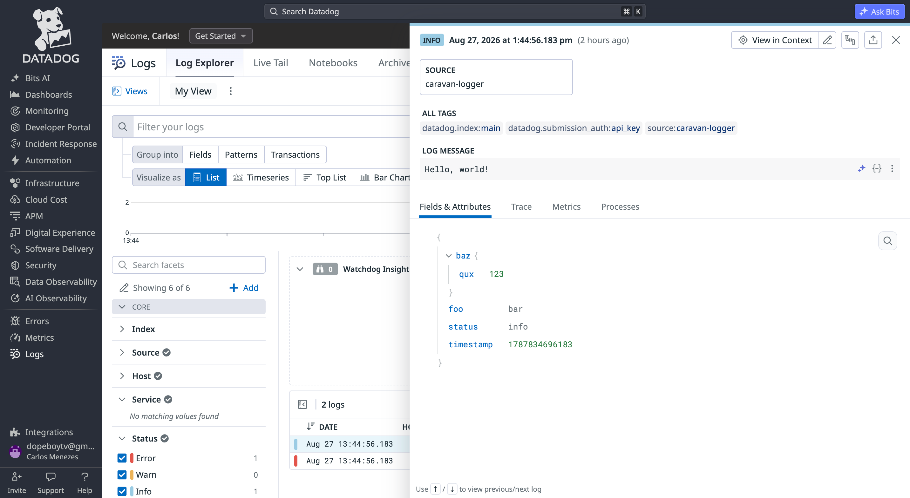

# @caravan-logger/transport-datadog

  

A [Caravan](../../README.md) transport that sends log records to
[Datadog's Logs API](https://docs.datadoghq.com/api/latest/logs/).

## Install

```sh
pnpm add @caravan-logger/transport-datadog
```

## Usage

```ts
import { createLogger } from "@caravan-logger/logger";
import { createDatadogTransport } from "@caravan-logger/transport-datadog";

const logger = createLogger("app", {
  transports: [
    createDatadogTransport({
      apiKey: process.env.DD_API_KEY!,
      service: "caravan-logger",
      site: "datadoghq.eu",
    }),
  ],
});

logger.info("Hello, world!", { foo: "bar", baz: { qux: 123 } });
await logger.flush();
```



## Options

| Option               | Type                                                      | Default                     | Description                                                                                                                                                      |
| -------------------- | --------------------------------------------------------- | --------------------------- | ---------------------------------------------------------------------------------------------------------------------------------------------------------------- |
| `apiKey`             | `string`                                                  | —                           | Datadog API key (required).                                                                                                                                      |
| `site`               | `TDatadogSite`                                            | `"datadoghq.com"`           | Datadog site domain.                                                                                                                                             |
| `url`                | `string`                                                  | derived from `site`         | Overrides the intake URL entirely.                                                                                                                               |
| `service`            | `string`                                                  | —                           | Reported as `service` on each log entry.                                                                                                                         |
| `ddsource`           | `string`                                                  | `"caravan-logger"`          | Reported as `ddsource` on each log entry.                                                                                                                        |
| `hostname`           | `string`                                                  | —                           | Reported as `hostname` on each log entry.                                                                                                                        |
| `tags`               | `string[] \| Record<string, string \| number \| boolean>` | —                           | Applied as `ddtags` on each log entry.                                                                                                                           |
| `format`             | `(record: TLogRecord) => Record<string, unknown>`         | default Datadog mapping     | Overrides how a record is mapped to a Datadog log entry.                                                                                                         |
| `batch`              | `boolean`                                                 | `false`                     | Enables buffering records into batched sends.                                                                                                                    |
| `batchConfiguration` | `{ size?: number; flushInterval?: number }`               | —                           | Tunes batching: `size` records buffered before a send (default `1`), and/or `flushInterval` (ms) to send regardless of `size`. Only used when `batch` is `true`. |
| `fetch`              | `typeof fetch`                                            | global `fetch`              | Fetch implementation used to call the intake API.                                                                                                                |
| `level`              | `TDefaultLevels`                                          | inherits the logger's level | Drops records below this level before `write()` runs.                                                                                                            |

Legacy options `batchSize` and `flushInterval` are still supported but deprecated; prefer `batch: true` with `batchConfiguration`.
